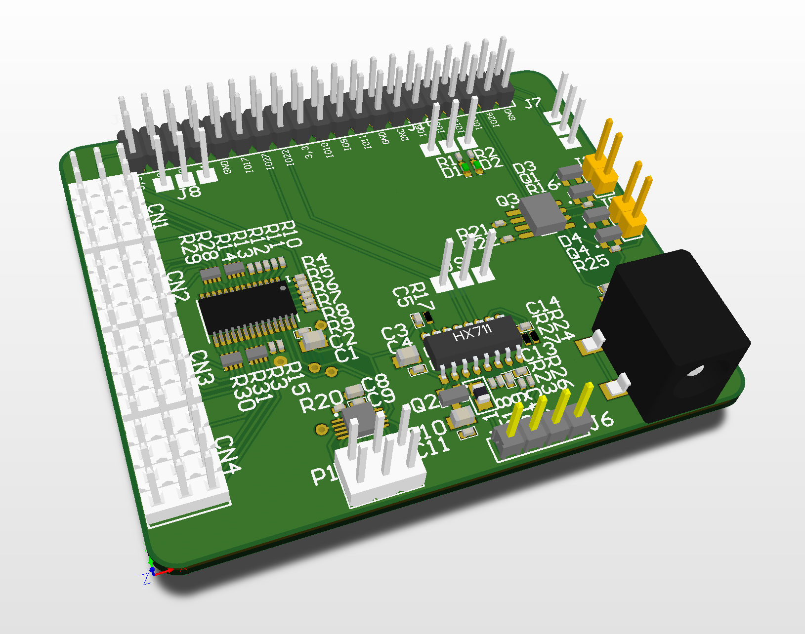

#Hardware Design

##Mechanical Build
The system was modelled in Autodesk Inventor Professional and comprised of aluminium extrusion and fixtures, COTS optics with rail mounts, and custom designed 3D printed PLA components. 

##Electronic Design
The system electronics were designed utilising Altium's CircuitMaker open-hardware designer. This package provides added functionality in ways of a community generated parts library integrated with the Octopart component database, aiding in speed of design and distributor oriented part selection and BOM generation. The main shield went through two revisions. An initial low quality test PCB created in house at the Univeristy of Glasgow featured the base servo control functionality, and aided in iterating the mechanical design.  The final board was designed to a higher specification and manufactured using JLCPCB's prototype PCB service.

###Final Shield Rendering

The populated board provided the following core features:
* x8 Servo channels
* x1 Load cell amplifier input
* x1 Digital proximity sensor input
* x2 Debug GPIO pins with LEDs

For future development, pads were also provided for:
* x8 Additional servo channels
* x4 General purpose ADC inputs
* x1 Spare load cell amplifier channel
* x2 Opto-isolated solenoid drivers with 12V rail

For full design files, see the publicly accessible CircuitMaker project: https://circuitmaker.com/Projects/Details/Peter-Fleming-2/UoG-mai-automated-bar