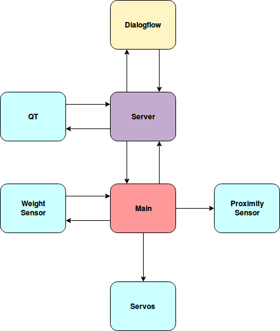

[](https://travis-ci.org/uog-mai/automated-bar)
[](https://www.codacy.com/app/eddymj96/automated-bar?utm_source=github.com&amp;utm_medium=referral&amp;utm_content=uog-mai/automated-bar&amp;utm_campaign=Badge_Grade)

# Automated-Bar
### Completed as a project towards Real Time Embedded Programming 5 at the University of Glasgow
This project aims to produce a low-cost automated drinks vending system for use in high-end consumer and commercial applications.

## Features
Scalability to any assortment of spirits and mixers

Google API integration for voice ordering

Extensive crawled database of recipes

Based on a Raspberry Pi 3 Model B

Low-cost aluminium extrusion structure

3D printed PLA fixtures

9g servo actuators

## Install Instructions
This software has only been verified to work compile on Raspberry Pi 3 Model B ```raspian (stretch)``` and ```Ubuntu 16.04```, however it should work on other raspbain distros and RPI models too.

This installation has should be run from the command line of the Raspberry Pi by first cloning this git repo.
```bash
git clone https://github.com/uog-mai/automated-bar/
cd automated-bar/Software/
sudo source build.sh
```
This will download, install and compile all dependencies and the source

## Overview

### Hardware 

Full CAD resources including Autodesk Inventor files and assemblies of the system can be found within our Hardware subsection, and full electronics design files are available through the [Altium CircuitMaker community.](https://circuitmaker.com/Projects/Details/Peter-Fleming-2/UoG-mai-automated-bar) 

For full build instructions and BOM please see our Instructables page INSTRUCTABLES LINK HERE

### Software




